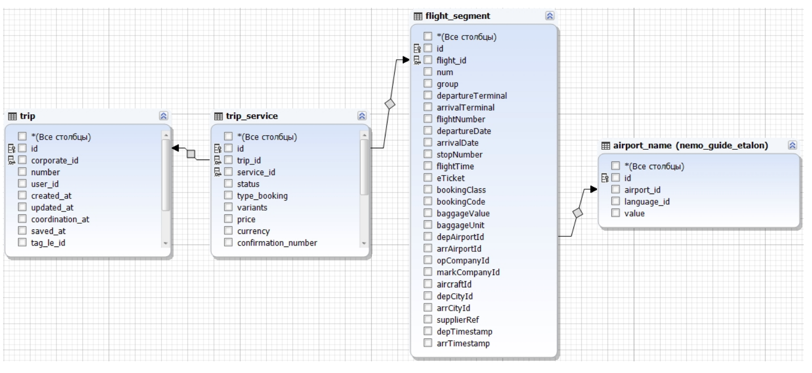

##  «Backend-разработчик»
### Тестовое задание
Реализовать приложение на Yii2 c использованием AR, выводящее весь список 
командировок с аэропортом вылета Домодедово, Москва, для trip.coprorate_id = 3 и
trip_service.service_id = 2. Полученные результаты должны выводиться в виджете GridView.

#### Особенности:
Приложение должно быть рассчитано на работу под нагрузкой как с большим объемом 
данных так и с большим количеством обращений. 
#### Исходные данные:
Две базы данных:
• cbt (Дамп приложен в письме cbt.sql.gz)
• guide_etalon (Дамп приложен в письме nemo_guide_etalon.sql.gz)
При выполнении задания базы объединять нельзя.
Ожидаемое поведение:
1. Выполнить миграцию исходных БД к виду на схеме. Скрипты миграций приложить.

2. Параметры trip.coprorate_id = 3, trip_service.service_id = 2 и аэропорт вылета 
Домодедово, Москва должны приходить через $GET запрос.
3. При необходимости выполнить оптимизация запросов индексов и т.д. Изменения 
внести в скрипты миграции.
Результаты разместить в публичном репозитор